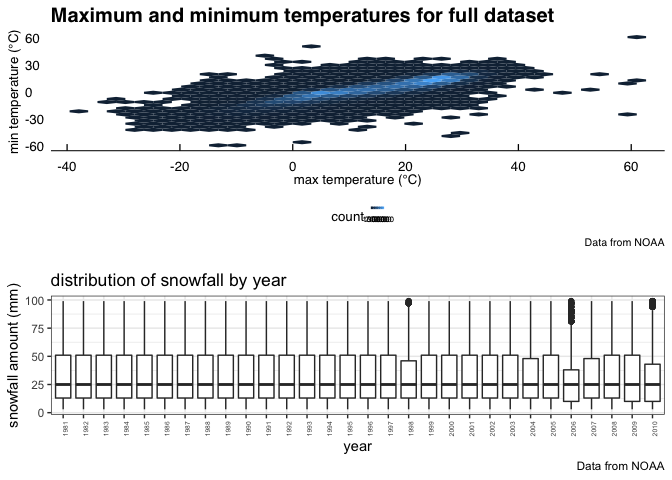

P8105\_hw3\_cs3652
================
Chirag Shah
2018-10-15

``` r
library(tidyverse)
```

    ## ── Attaching packages ─────────────────────────────────────────── tidyverse 1.2.1 ──

    ## ✔ ggplot2 3.0.0     ✔ purrr   0.2.5
    ## ✔ tibble  1.4.2     ✔ dplyr   0.7.6
    ## ✔ tidyr   0.8.1     ✔ stringr 1.3.1
    ## ✔ readr   1.1.1     ✔ forcats 0.3.0

    ## ── Conflicts ────────────────────────────────────────────── tidyverse_conflicts() ──
    ## ✖ dplyr::filter() masks stats::filter()
    ## ✖ dplyr::lag()    masks stats::lag()

``` r
library(httr)
library(jsonlite)
```

    ## 
    ## Attaching package: 'jsonlite'

    ## The following object is masked from 'package:purrr':
    ## 
    ##     flatten

``` r
library(patchwork)
library(hexbin)
```

Problem 1
---------

``` r
library(p8105.datasets)
data("brfss_smart2010")
##reading in data

brfss_data = brfss_smart2010 %>% 
  janitor::clean_names() %>% 
  select(location_abbr = locationabbr, location_desc = locationdesc, year, topic, response, data_value) %>% 
  ##tidying data by cleaning names and renaming
  filter(topic == "Overall Health") %>% 
  ##focusing on Overall Health
  filter(response == "Excellent" | response == "Very good" | response == "Good" | response == "Fair" | response == "Poor") %>% 
  mutate(response = factor(response, levels = ordered(c("Excellent", "Very good", "Good", "Fair", "Poor"))))
  ##ordering response variable
```

``` r
brfss_data %>% 
  select(year, location_abbr, location_desc) %>% 
  filter(year == "2002") %>% 
  ##filtering data for 2002
  distinct(location_desc, location_abbr) %>% 
  group_by(location_abbr) %>% 
  summarize(locations_7 = n()) %>% 
  ##getting number of locations 
  filter(locations_7 == "7")
```

    ## # A tibble: 3 x 2
    ##   location_abbr locations_7
    ##   <chr>               <int>
    ## 1 CT                      7
    ## 2 FL                      7
    ## 3 NC                      7

In 2002, CT, FL, and NC were observed at 7 locations.

``` r
brfss_data %>% 
  select(year, location_abbr, location_desc) %>% 
  filter(year > 2001, year < 2011) %>%
  ##selecting years from 2002 to 2010
  group_by(location_abbr, year) %>% 
  distinct(location_desc, location_abbr) %>% 
  summarize(locations_per_state = n()) %>%
  ##creating variable for locations per state that are distinct
  ggplot(aes(x = year, y = locations_per_state, color = location_abbr)) +
  geom_line() +
  ##creating speghetti plot
  labs(
    title = "Number of Locations in Each State From 2002-2010",
    x = "year",
    y = "number of locations",
    caption = "data from the BRFSS dataset"
  ) +
  viridis::scale_color_viridis(
    name = "state", 
    discrete = TRUE
  ) + 
  ggthemes::theme_economist() +
  theme(legend.position = "bottom", legend.text = element_text(size = 6), legend.key.size = unit(2, "point"))
```


``` r
##makeing the graph easier to read and using formats to make it look good
```

This graph depicts the number of locations in each state for every year from 2002 to 2010 (inclusive). The speghetti plot probably wasn't the best graphing tool to depict this data.

``` r
brfss_data %>%
  spread(key = response, value = data_value) %>%
  ##separating the response variable 
  select(year, Excellent, location_abbr) %>% 
  filter(!is.na(Excellent), location_abbr == "NY", (year == "2002" | year == "2006" | year == "2010")) %>%
  ##choosing exchellent, the years, and the state desired
  group_by(year) %>% 
  summarize(mean_proportion_excellent = mean(Excellent), sd_proportion_excellent = sd(Excellent)) %>% 
  ##getting the mean and standard deviation of the proportion of Excellent
  knitr::kable()
```

|  year|  mean\_proportion\_excellent|  sd\_proportion\_excellent|
|-----:|----------------------------:|--------------------------:|
|  2002|                     24.04000|                   4.486424|
|  2006|                     22.53333|                   4.000833|
|  2010|                     22.70000|                   3.567212|

``` r
  ##creating good looking table
```

This table consisely shows the mean and standard deviation of the propotion of excellent responses across locations in NY State for 2002, 2006, and 2010.

``` r
brfss_data %>% 
  select(year, location_abbr, response, data_value) %>% 
  group_by(year, location_abbr, response) %>% 
  summarize(avg_response = mean(data_value)) %>% 
  ##getting average proportion for each response category
  ggplot(aes(x = year, y = avg_response, color = location_abbr)) + 
  geom_point() +
  ##creating plot
  labs(
    title = "Average Proportion of Each Response Category in Each State Over Time",
    x = "year",
    y = "average proportion of response",
    caption = "data from BRFSS_2010"
  ) +
  viridis::scale_color_viridis(
    name = "state", 
    discrete = TRUE
  ) + 
  ggthemes::theme_economist() + 
  theme(legend.position = "bottom", legend.text = element_text(size = 6), legend.key.size = unit(2, "point")) +
  ##makeing the graph easier to read
  facet_grid(~ response) 
```

    ## Warning: Removed 21 rows containing missing values (geom_point).


``` r
  ##panelling by the response variable 
```

This graph depicts the distribution of state-level average proportion in each response category. There are 5 panels which shows the distribution of each response type separately.

Problem 2
---------

``` r
library(p8105.datasets)
data("instacart")
##reading in data

instacart_data = instacart %>% 
  janitor::clean_names()
  ##tidying variable names
```

This data set contains 1384617 rows and 15 colums with 1384617 overvations. There were 131209 distinct user ids in this dataset. Some of the key variables are `user_id`, `product_name`, and `department`. One illustrative example is 112108, who purchased Bulgarian Yogurt from dairy eggs department.

``` r
instacart_data %>% 
  select(aisle) %>% 
  count()
```

    ## # A tibble: 1 x 1
    ##         n
    ##     <int>
    ## 1 1384617

``` r
  ##finding the number of aisles

instacart_data %>% 
  group_by(aisle) %>% 
  summarize(amount_ordered = n()) %>%
  ##creating amount ordered variable
  arrange(desc(amount_ordered)) %>% 
  ##ordering from most to least
  select(aisle) %>% 
  head(1)
```

    ## # A tibble: 1 x 1
    ##   aisle           
    ##   <chr>           
    ## 1 fresh vegetables

``` r
  ##choosing the top observation
```

There are 1384617 aisles. The aisle that most items are ordered from is fresh vegetables.

``` r
instacart_data %>% 
  group_by(aisle) %>% 
  ##grouping by aisle
  summarize(amount_ordered = n()) %>% 
  ##computing the amount ordered in each aisle after groupby step
  ggplot(aes(x = aisle, y = amount_ordered)) + 
  geom_point() +
  ##creating plot
  labs(
     title = "Items ordered in each aisle",
     x = "aisle",
     y = "number of items ordered"
    ) +
    theme_bw() +
    theme(legend.position = "bottom")
```


``` r
  ##making graph easier to read
```

This plot shows the number of items ordered in each aisle.

``` r
instacart_data %>% 
  filter(aisle == "baking ingredients" | aisle == "dog food care" | aisle == "packaged vegetables fruits") %>% 
  ##filtering aisles that we want
  group_by(aisle, product_name) %>% 
  ##grouping by aisle product name
  summarize(number_ordered = n()) %>% 
  arrange(desc(number_ordered)) %>% 
  ##going from most to least for number of a specific product ordered
  group_by(aisle) %>% 
  top_n(n = 1) %>% 
  ##taking top observation after grouping by aisle
  rename(most_popular_item = product_name) %>% 
  knitr::kable()
```

    ## Selecting by number_ordered

| aisle                      | most\_popular\_item                           |  number\_ordered|
|:---------------------------|:----------------------------------------------|----------------:|
| packaged vegetables fruits | Organic Baby Spinach                          |             9784|
| baking ingredients         | Light Brown Sugar                             |              499|
| dog food care              | Snack Sticks Chicken & Rice Recipe Dog Treats |               30|

``` r
  ##creating table that is easy to read
```

This table shows the most populat item in each of the aisles "baking ingredients", "dog food care", and "packaged vegetables fruits".

``` r
instacart_data %>% 
  filter(product_name == "Pink Lady Apples" | product_name == "Coffee Ice Cream") %>% 
  ##filtering products that we want 
  select(product_name, order_dow, order_hour_of_day) %>% 
  group_by(order_dow, product_name) %>% 
  summarize(mean_hour = mean(order_hour_of_day)) %>% 
  ##computing the mean hour of the day that the item was ordered
  spread(key = order_dow, value = mean_hour) %>% 
  knitr::kable()
```

| product\_name    |         0|         1|         2|         3|         4|         5|         6|
|:-----------------|---------:|---------:|---------:|---------:|---------:|---------:|---------:|
| Coffee Ice Cream |  13.77419|  14.31579|  15.38095|  15.31818|  15.21739|  12.26316|  13.83333|
| Pink Lady Apples |  13.44118|  11.36000|  11.70213|  14.25000|  11.55172|  12.78431|  11.93750|

``` r
  ##making readable table
```

This 2x7 table shows the mean hour of the day at which Pink Lady Apples and Coffee Ice Cream are ordered on each day of the week.

Problem 3
---------

``` r
library(p8105.datasets)
data(ny_noaa)
##reading in the data
```

This dataset contains 2595176 rows and 7 columns, with 2595176 observations. There are 747 distinct weather stations in this dataset. Some key variables are the id (`id`), the date of weather observation (`date`), the precipitation that occured (`prcp`), the maximum and minimum temperatures (given by `tmax` and `tmin` respectively). One illustrative example is for the station with id US1NYAB0001 where they measured weather data on 2007-11-01. There was several missing observations in this dataset for prcp, tmin, and tmax. It's a significant issue because there are 1372743 missing observations.

``` r
ny_noaa_data = ny_noaa %>%
  janitor::clean_names() %>% 
  ##cleaning the variable names
  separate(date, into = c("year", "month", "day"), sep = "-") %>%
  ##separating the date into 3 new variables
  mutate(prcp = prcp / 10, tmax = as.integer(tmax) / 10, tmin = as.integer(tmin) / 10)
  ##change to appropriate units since prcp was in tenths of mm and temperatures were in tenths of degrees celcius 
ny_noaa_data %>% 
  group_by(snow) %>% 
  summarize(freq_observed = n()) %>% 
  ##creating frequency observed variable
  arrange(desc(freq_observed)) %>% 
  ##ordering from most observed frequency to least
  head(1)
```

    ## # A tibble: 1 x 2
    ##    snow freq_observed
    ##   <int>         <int>
    ## 1     0       2008508

``` r
  ##getting top observation after arragement 
```

For snowfall the most commonly observed value is 0. This is probably because snow doesn't fall in most months of the calendar year thus the value is 0.

``` r
ny_noaa_data %>% 
  filter(tmax != "NA", (month == "01" | month == "07")) %>% 
  group_by(id, year, month) %>% 
  summarize(avg_tmax = mean(tmax)) %>%
  ##computing the average max temperature
  ggplot(aes(x = year, y = avg_tmax, color = id)) +
    geom_point() +
  ##creating plot of max temperature for each individual id
  scale_x_discrete(breaks = c(1980, 1985, 1990, 1995, 2000, 2005, 2010)) +
  ##showing select years on the x axis to be more readable 
  facet_grid(~month) +  
  ##pannelling by the two months we selected earlier
  labs(
      x = "year",
      y = "average temp (°C)",
      title = "Average Maximum Temperatures for January and July in New York Weather Stations Over Time",
      caption = "Data from NOAA"
    ) +
    viridis::scale_color_viridis(
      discrete = TRUE,
      name = "ID"
    ) +
    ggthemes::theme_economist() +
    theme(legend.position = "bottom", legend.text = element_text(size = 6), legend.key.size = unit(2, "point")) +
    guides(color = guide_legend(nrow = 20))
```


``` r
  ##making the graph easier to read 
```

This plot depicts the average maximum temperature in January and July in each station across the years. There is some observable/interpretable structure ascertained from this graph in that average maximum temperatures are higher in July than January across the years. There are two outliers that are easily observable from this graph in July of 2004 where there was one datapoint for tmax much lower than the others. The other looks like it occured in Janurary of 1993 where the tmax was much lower than the others in that year and month.

``` r
t_max_min_plot = ny_noaa_data %>% 
  filter(tmax != "NA" & tmin != "NA") %>% 
  ggplot(aes(x = tmax, y = tmin)) + 
  ##creating a graph of tmax vs tmin
    geom_hex() + 
  ##choosing appropriate graph type to depict information
  labs(
      x = "max temperature (°C)",
      y = "min temperature (°C)",
      title = "Maximum and minimum temperatures for full dataset",
      caption = "Data from NOAA"
    ) + 
  ggthemes::theme_economist() +
  theme(legend.position = "bottom", legend.text = element_text(size = 6), legend.key.size = unit(2, "point"))
##making the graph easier to read

snowfall_plot = ny_noaa_data %>% 
  filter(snow != "NA" & snow > 0 & snow < 100) %>% 
  ##choosing snowfall creater than 0 and less than 100
  ggplot(aes(x = year, y = snow)) +
  geom_boxplot() +
  ##using boxplot to show distribution of snowfall
    labs(
      x = "year",
      y = "snowfall amount (mm)",
      title = "distribution of snowfall by year",
      caption = "Data from NOAA"
    ) + 
  theme_bw() +
  theme(axis.text.x = element_text(angle = 90, size = 5))
  ##making the graph easy to read

t_max_min_plot / snowfall_plot
```

 The above plot is multipanelled showing the relationship between maximum temperature and minimum temperature for the full dataset as well as showing the distribution of snowfall by year in the form of a boxplot.
