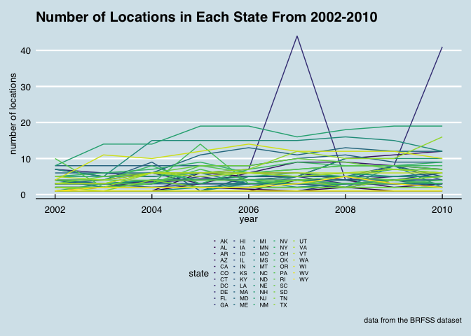

P8105\_hw3\_cs3652
================
Chirag Shah
2018-10-15

``` r
library(tidyverse)
```

    ## ── Attaching packages ────────────────────────────────────────────────────────── tidyverse 1.2.1 ──

    ## ✔ ggplot2 3.0.0     ✔ purrr   0.2.5
    ## ✔ tibble  1.4.2     ✔ dplyr   0.7.6
    ## ✔ tidyr   0.8.1     ✔ stringr 1.3.1
    ## ✔ readr   1.1.1     ✔ forcats 0.3.0

    ## ── Conflicts ───────────────────────────────────────────────────────────── tidyverse_conflicts() ──
    ## ✖ dplyr::filter() masks stats::filter()
    ## ✖ dplyr::lag()    masks stats::lag()

``` r
library(httr)
library(jsonlite)
```

    ## 
    ## Attaching package: 'jsonlite'

    ## The following object is masked from 'package:purrr':
    ## 
    ##     flatten

Problem 1
---------

``` r
library(p8105.datasets)
data("brfss_smart2010")

brfss_data = brfss_smart2010 %>% 
  janitor::clean_names() %>% 
  select(location_abbr = locationabbr, location_desc = locationdesc, year, topic, response, data_value) %>% 
  filter(topic == "Overall Health") %>% 
  filter(response == "Excellent" | response == "Very good" | response == "Good" | response == "Fair" | response == "Poor") %>% 
  mutate(response = factor(response, levels = ordered(c("Excellent", "Very good", "Good", "Fair", "Poor"))))
```

``` r
brfss_data %>% 
  select(year, location_abbr, location_desc) %>% 
  filter(year == "2002") %>% 
  distinct(location_desc, location_abbr) %>% 
  group_by(location_abbr) %>% 
  summarize(locations_7 = n()) %>% 
  filter(locations_7 == "7")
```

    ## # A tibble: 3 x 2
    ##   location_abbr locations_7
    ##   <chr>               <int>
    ## 1 CT                      7
    ## 2 FL                      7
    ## 3 NC                      7

``` r
brfss_data %>% 
  select(year, location_abbr, location_desc) %>% 
  filter(year > 2001, year < 2011) %>% 
  group_by(location_abbr, year) %>% 
  distinct(location_desc, location_abbr) %>% 
  summarize(locations_per_state = n()) %>%
  ggplot(aes(x = year, y = locations_per_state, color = location_abbr)) +
  geom_line() +
  labs(
    title = "Number of Locations in Each State From 2002-2010",
    x = "year",
    y = "number of locations",
    caption = "data from the BRFSS dataset"
  ) +
  viridis::scale_color_viridis(
    name = "state", 
    discrete = TRUE
  ) + 
  ggthemes::theme_economist() +
  theme(legend.position = "bottom")
```



col\_types = "dccccccdddddccccccccc" %&gt;%
-------------------------------------------

``` r
brfss_data %>%
  spread(key = response, value = data_value) %>%
  select(year, Excellent, location_abbr) %>% 
  filter(!is.na(Excellent) & location_abbr == "NY" & (year == "2002" | year == "2006" | year == "2010")) %>%
  group_by(year) %>% 
  summarize(mean_proportion_excellent = mean(Excellent), sd_proportion_excellent = sd(Excellent)) %>% 
  knitr::kable()
```

|  year|  mean\_proportion\_excellent|  sd\_proportion\_excellent|
|-----:|----------------------------:|--------------------------:|
|  2002|                     24.04000|                   4.486424|
|  2006|                     22.53333|                   4.000833|
|  2010|                     22.70000|                   3.567212|

``` r
brfss_data %>% 
  select(year, location_abbr, response, data_value) %>% 
  group_by(year, location_abbr, response) %>% 
  summarize(avg_response = mean(data_value)) %>% 
  ggplot(aes(x = year, y = avg_response, color = location_abbr)) + 
  geom_point() +
  labs(
    title = "Average Proportion of Each Response Category in Each State Over Time",
    x = "year",
    y = "average proportion of response",
    caption = "data from BRFSS_2010"
  ) +
  viridis::scale_color_viridis(
    name = "state", 
    discrete = TRUE
  ) + 
  ggthemes::theme_economist() + 
  theme(legend.position = "bottom") +
  facet_grid(~ response) 
```

    ## Warning: Removed 21 rows containing missing values (geom_point).


For each year and state, compute the average proportion in each response category (taking the average across locations in a state). Make a five-panel plot that shows, for each response category separately, the distribution of these state-level averages over time.
