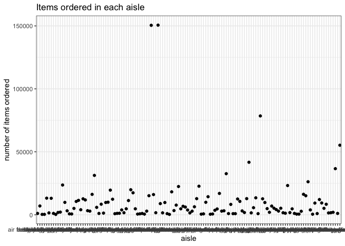
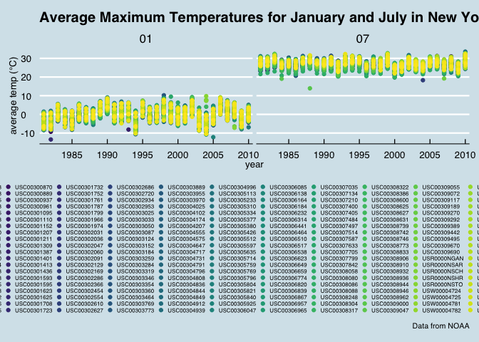

P8105\_hw3\_cs3652
================
Chirag Shah
2018-10-15

``` r
library(tidyverse)
```

    ## ── Attaching packages ────────────────────────────────────────────────────────── tidyverse 1.2.1 ──

    ## ✔ ggplot2 3.0.0     ✔ purrr   0.2.5
    ## ✔ tibble  1.4.2     ✔ dplyr   0.7.6
    ## ✔ tidyr   0.8.1     ✔ stringr 1.3.1
    ## ✔ readr   1.1.1     ✔ forcats 0.3.0

    ## ── Conflicts ───────────────────────────────────────────────────────────── tidyverse_conflicts() ──
    ## ✖ dplyr::filter() masks stats::filter()
    ## ✖ dplyr::lag()    masks stats::lag()

``` r
library(httr)
library(jsonlite)
```

    ## 
    ## Attaching package: 'jsonlite'

    ## The following object is masked from 'package:purrr':
    ## 
    ##     flatten

Problem 1
---------

``` r
library(p8105.datasets)
data("brfss_smart2010")

brfss_data = brfss_smart2010 %>% 
  janitor::clean_names() %>% 
  select(location_abbr = locationabbr, location_desc = locationdesc, year, topic, response, data_value) %>% 
  filter(topic == "Overall Health") %>% 
  filter(response == "Excellent" | response == "Very good" | response == "Good" | response == "Fair" | response == "Poor") %>% 
  mutate(response = factor(response, levels = ordered(c("Excellent", "Very good", "Good", "Fair", "Poor"))))
```

``` r
brfss_data %>% 
  select(year, location_abbr, location_desc) %>% 
  filter(year == "2002") %>% 
  distinct(location_desc, location_abbr) %>% 
  group_by(location_abbr) %>% 
  summarize(locations_7 = n()) %>% 
  filter(locations_7 == "7")
```

    ## # A tibble: 3 x 2
    ##   location_abbr locations_7
    ##   <chr>               <int>
    ## 1 CT                      7
    ## 2 FL                      7
    ## 3 NC                      7

``` r
brfss_data %>% 
  select(year, location_abbr, location_desc) %>% 
  filter(year > 2001, year < 2011) %>% 
  group_by(location_abbr, year) %>% 
  distinct(location_desc, location_abbr) %>% 
  summarize(locations_per_state = n()) %>%
  ggplot(aes(x = year, y = locations_per_state, color = location_abbr)) +
  geom_line() +
  labs(
    title = "Number of Locations in Each State From 2002-2010",
    x = "year",
    y = "number of locations",
    caption = "data from the BRFSS dataset"
  ) +
  viridis::scale_color_viridis(
    name = "state", 
    discrete = TRUE
  ) + 
  ggthemes::theme_economist() +
  theme(legend.position = "bottom", legend.text = element_text(size = 6), legend.key.size = unit(2, "point"))
```


col\_types = "dccccccdddddccccccccc" %&gt;%
-------------------------------------------

``` r
brfss_data %>%
  spread(key = response, value = data_value) %>%
  select(year, Excellent, location_abbr) %>% 
  filter(!is.na(Excellent) & location_abbr == "NY" & (year == "2002" | year == "2006" | year == "2010")) %>%
  group_by(year) %>% 
  summarize(mean_proportion_excellent = mean(Excellent), sd_proportion_excellent = sd(Excellent)) %>% 
  knitr::kable()
```

|  year|  mean\_proportion\_excellent|  sd\_proportion\_excellent|
|-----:|----------------------------:|--------------------------:|
|  2002|                     24.04000|                   4.486424|
|  2006|                     22.53333|                   4.000833|
|  2010|                     22.70000|                   3.567212|

``` r
brfss_data %>% 
  select(year, location_abbr, response, data_value) %>% 
  group_by(year, location_abbr, response) %>% 
  summarize(avg_response = mean(data_value)) %>% 
  ggplot(aes(x = year, y = avg_response, color = location_abbr)) + 
  geom_point() +
  labs(
    title = "Average Proportion of Each Response Category in Each State Over Time",
    x = "year",
    y = "average proportion of response",
    caption = "data from BRFSS_2010"
  ) +
  viridis::scale_color_viridis(
    name = "state", 
    discrete = TRUE
  ) + 
  ggthemes::theme_economist() + 
  theme(legend.position = "bottom", legend.text = element_text(size = 6), legend.key.size = unit(2, "point")) +
  facet_grid(~ response) 
```

    ## Warning: Removed 21 rows containing missing values (geom_point).


Problem 2
---------

``` r
library(p8105.datasets)
data("instacart")

instacart_data = instacart %>% 
  janitor::clean_names()
```

To that end, write a short description of the dataset, noting the size and structure of the data, describing some key variables, and giving illstrative examples of observations. Then, do or answer the following (commenting on the results of each): 1384617 15 observations: 1384617 distict users 131209 key variables: `user_id` 112108 `product_name` Bulgarian Yogurt `department` dairy eggs

How many aisles are there, and which aisles are the most items ordered from?

``` r
instacart_data %>% 
  select(aisle) %>% 
  count()
```

    ## # A tibble: 1 x 1
    ##         n
    ##     <int>
    ## 1 1384617

``` r
instacart_data %>% 
  group_by(aisle) %>% 
  summarize(amount_ordered = n()) %>% 
  arrange(desc(amount_ordered)) %>% 
  select(aisle) %>% 
  head(1)
```

    ## # A tibble: 1 x 1
    ##   aisle           
    ##   <chr>           
    ## 1 fresh vegetables

Make a plot that shows the number of items ordered in each aisle. Order aisles sensibly, and organize your plot so others can read it.

``` r
instacart_data %>% 
  group_by(aisle) %>% 
  summarize(amount_ordered = n()) %>% 
  ggplot(aes(x = aisle, y = amount_ordered)) + 
  geom_point() +
  labs(
     title = "Items ordered in each aisle",
     x = "aisle",
     y = "number of items ordered"
    ) +
    theme_bw() +
    theme(legend.position = "bottom")
```



    Make a table showing the most popular item in each of the aisles “baking ingredients”, “dog food care”, and “packaged vegetables fruits”.

``` r
instacart_data %>% 
  filter(aisle == "baking ingredients" | aisle == "dog food care" | aisle == "packaged vegetables fruits") %>% 
  group_by(aisle, product_name) %>% 
  summarize(number_ordered = n()) %>% 
  arrange(desc(number_ordered)) %>% 
  group_by(aisle) %>% 
  top_n(n = 1) %>% 
  rename(most_popular_item = product_name) %>% 
  knitr::kable()
```

    ## Selecting by number_ordered

| aisle                      | most\_popular\_item                           |  number\_ordered|
|:---------------------------|:----------------------------------------------|----------------:|
| packaged vegetables fruits | Organic Baby Spinach                          |             9784|
| baking ingredients         | Light Brown Sugar                             |              499|
| dog food care              | Snack Sticks Chicken & Rice Recipe Dog Treats |               30|

    Make a table showing the mean hour of the day at which Pink Lady Apples and Coffee Ice Cream are ordered on each day of the week; format this table for human readers (i.e. produce a 2 x 7 table).

``` r
instacart_data %>% 
  filter(product_name == "Pink Lady Apples" | product_name == "Coffee Ice Cream") %>% 
  select(product_name, order_dow, order_hour_of_day) %>% 
  group_by(order_dow, product_name) %>% 
  summarize(mean_hour = mean(order_hour_of_day)) %>% 
  spread(key = order_dow, value = mean_hour) %>% 
  knitr::kable()
```

| product\_name    |         0|         1|         2|         3|         4|         5|         6|
|:-----------------|---------:|---------:|---------:|---------:|---------:|---------:|---------:|
| Coffee Ice Cream |  13.77419|  14.31579|  15.38095|  15.31818|  15.21739|  12.26316|  13.83333|
| Pink Lady Apples |  13.44118|  11.36000|  11.70213|  14.25000|  11.55172|  12.78431|  11.93750|

Problem 3
---------

``` r
library(p8105.datasets)
data(ny_noaa)
```

2595176 7 2595176 observations 747 distinct weather stations key variables: id US1NYAB0001 date of the weather observation 2007-11-01 precipitation that occurred tmax and tmin variables give maximum and minimum temperatures missing data values in this data set for prcp, tmin, and tmax 1372743

``` r
ny_noaa_data = ny_noaa %>%
  janitor::clean_names() %>% 
  separate(date, into = c("year", "month", "day"), sep = "-") %>%
  mutate(prcp = prcp / 10, tmax = as.integer(tmax) / 10, tmin = as.integer(tmin) / 10)
  ##change to appropriate units since prcp was in tenths of mm and temperatures were in tenths of degrees celcius 
ny_noaa_data %>% 
  group_by(snow) %>% 
  summarize(freq_observed = n()) %>% 
  arrange(desc(freq_observed)) %>% 
  head(1)
```

    ## # A tibble: 1 x 2
    ##    snow freq_observed
    ##   <int>         <int>
    ## 1     0       2008508

Make a two-panel plot showing the average max temperature in January and in July in each station across years. Is there any observable / interpretable structure? Any outliers?

``` r
ny_noaa_data %>% 
  filter(tmax != "NA", (month == "01" | month == "07")) %>% 
  group_by(id, year, month) %>% 
  summarize(avg_tmax = mean(tmax)) %>%
  ggplot(aes(x = year, y = avg_tmax, color = id)) +
    geom_point() +
  scale_x_discrete(breaks = c(1980, 1985, 1990, 1995, 2000, 2005, 2010)) +
  facet_grid(~month) +  
  labs(
      x = "year",
      y = "average temp (°C)",
      title = "Average Maximum Temperatures for January and July in New York Weather Stations Over Time",
      caption = "Data from NOAA"
    ) +
    viridis::scale_color_viridis(
      discrete = TRUE,
      name = "ID"
    ) +
    ggthemes::theme_economist() +
    theme(legend.position = "bottom", legend.text = element_text(size = 6), legend.key.size = unit(2, "point")) +
    guides(color = guide_legend(nrow = 20))
```



Make a two-panel plot showing (i) tmax vs tmin for the full dataset (note that a scatterplot may not be the best option); and (ii) make a plot showing the distribution of snowfall values greater than 0 and less than 100 separately by year.

``` r
t_max_min_plot = ny_noaa_data %>% 
  filter(tmax != "NA" & tmin != "NA") %>% 
  ggplot(aes(x = tmax, y = tmin)) + 
    geom_hex() + 
  labs(
      x = "max temperature (°C)",
      y = "min temperature (°C)",
      title = "Maximum and minimum temperatures for full dataset",
      caption = "Data from NOAA"
    ) + 
  ggthemes::theme_economist()

snowfall_plot = ny_noaa_data %>% 
  filter(snow != "NA" & snow > 0 & snow < 100) %>% 
  ggplot(aes(x = year, y = snow)) +
  geom_boxplot() +
    labs(
      x = "year",
      y = "snowfall amount (mm)",
      title = "distribution of snowfall by year",
      caption = "Data from NOAA"
    ) + 
  theme_bw() +
  theme(axis.text.x = element_text(angle = 90, size = 5))

##t_max_min_plot / snowfall_plot
```
